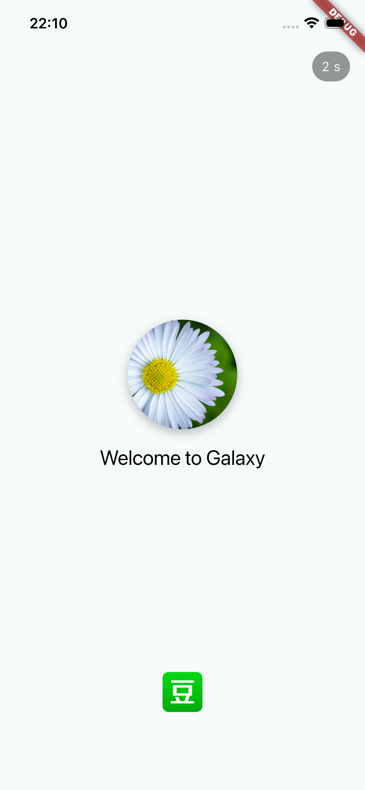

## 项目简介（Flutter练手）

`galaxy` 是一个基于 Flutter 的移动端示例应用，参考了豆瓣类的书影音界面，包含首页、列表、详情页和底部导航等常见布局。

主要功能：
- 使用 Flutter 构建跨平台移动界面（iOS/Android）
- 仿豆瓣风格的书影音列表与详情展示
- 使用本地示例数据（位于 `data/movies.json`）和静态资源（位于 `assets/`）
- 简单的模块化目录结构，代码位于 `lib/`，包含 `models/`、`pages/`、`services/` 等

快速运行：
1. 请先安装并配置好 Flutter（参考 https://docs.flutter.dev/ ）
2. 在项目根目录运行：
   - `flutter pub get`
   - `flutter run`

欢迎提交 issue 或 PR，或参考仓库内的示例资源进行二次开发。

## 演示与素材

项目中包含若干用于 README 演示的图片与视频素材，存放在 `assets/introduce/`：

- `assets/introduce/splash_page.png`：启动页示例截图
- `assets/introduce/book_videos_page.png`：书影音页面示例截图
- `assets/introduce/detail_page.png`：详情页示例截图
- `assets/introduce/books_videos.mov`：界面交互演示视频（可用系统播放器或 QuickTime 播放）

效果图演示：

   

   

   

[演示视频（点击查看）](assets/introduce/books_videos.mov)
